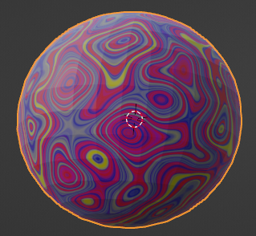

## You will make

In this project, you will make a marble in Blender and create materials that wrap around it.

You will:
+ Use a **UV Sphere** object to create a marble
+ Add a **material** to your marble
+ Adjust the colour **effects** of the marble to personalise it

One use of **Blender** is by **Brazillian 3D Designer Cicero Moraes** who works with a team of vets and a dental surgeon to create life-saving 3D printed prosetics for animals. They have helped animals like:
<ul>
<li>
+ Freddy the tortoise who had a shell that was severely damaged by fire 
</li>
<li>
+ Several toucans, a goose, and a macaw with deformed beaks or beaks damaged in accidents
</li>
<li>
+ Zeus the puppy who lost a foot after a vicious attack
</li>
<li>
+ Hannah the Labrador who wasnt eating after loosing a tooth
</li>
</ul>

### Finished marble

You will have lots of opportunities to personalise your marble to get it just right!

