## Create a marble 

Create a marble using a **UV sphere** object. Add a new material to the sphere.

{:width="300px"}

### Set up your project

--- task ---

Open Blender. Click outside the **splash screen** to close it: 

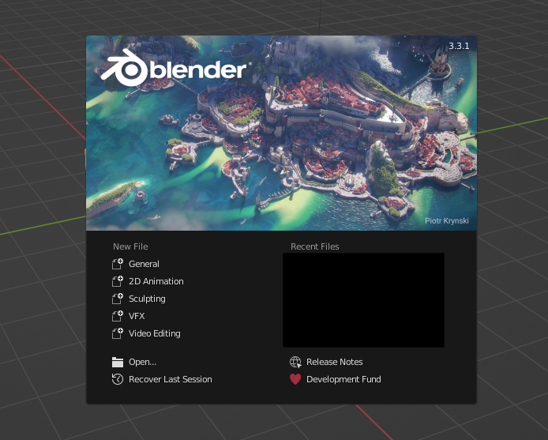

A **Cube** object has been created for you. The cube has an orange outline to show it is the selected object:

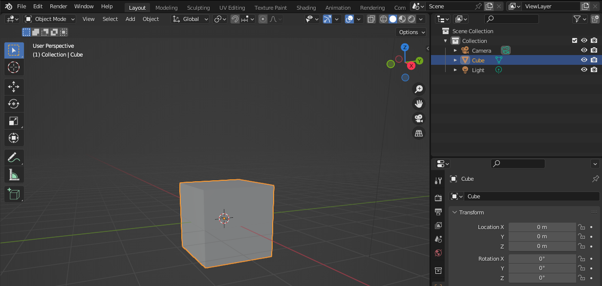

--- /task ---

--- task ---

Click on the **Cube** and press **<kbd>Delete</kbd>** on your keyboard. This will give you an empty document to add in your sphere:

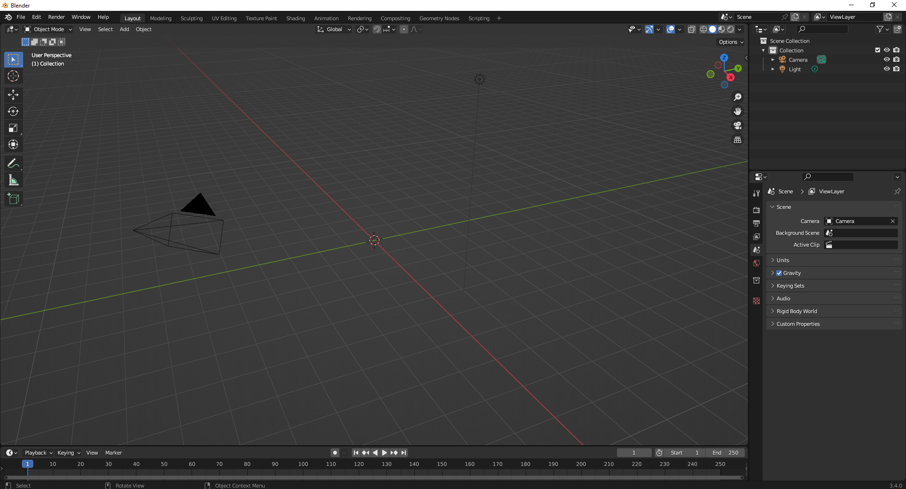

**Tip**: You can also right-click on the cube and choose 'Delete' to delete the cube.

--- /task ---

--- task ---

For this project, you need to enable the **Node Wrangler**. 

Go to the 'Edit' menu then choose 'Preferences'.

Now select 'Add-ons' and search for `node`.

Tick the box next to 'Node: Node Wrangler' then close the Preferences window:

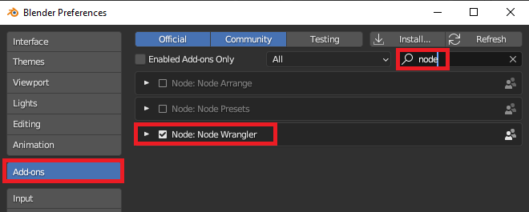

--- /task ---

### Create a marble

--- task ---

Add a new **UV Sphere** by going to 'Add' -> 'Mesh' -> 'UV Sphere':

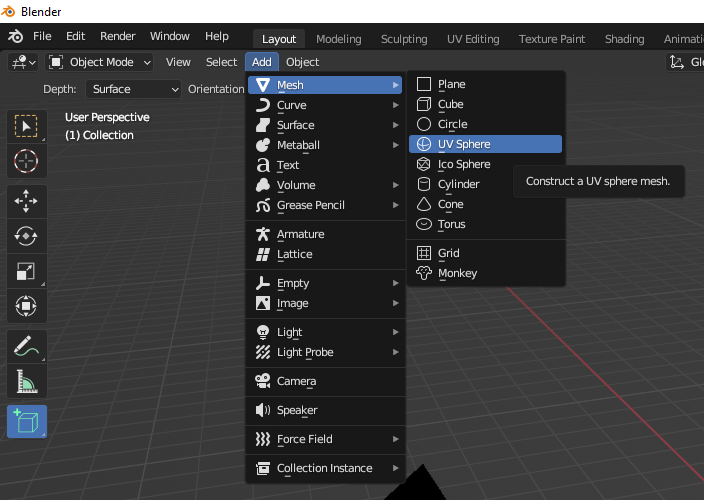

**Tip**: The icons in Blender are very small. Hover over them with your mouse to see a tool tip with the name of the tool. 

--- /task ---

--- task ---

With the **Sphere** selected, go to the 'Material Properties' tab. Click 'New' to add a new material to your sphere:

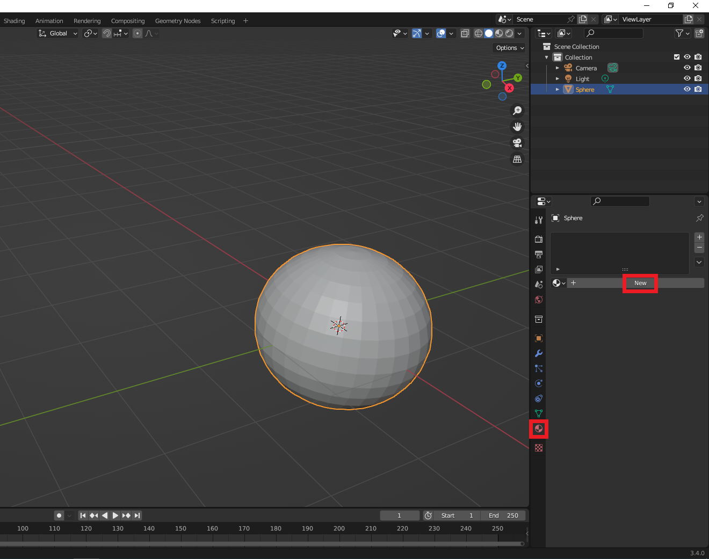

**Tip**: A selected object has an orange outline.

--- /task ---

### Open the Shading editor

--- task ---

The Blender 'Shading editor' is used to design and view materials. 

Go to the menu at the top of the screen and choose 'Shading'. This will open the Shading editor:

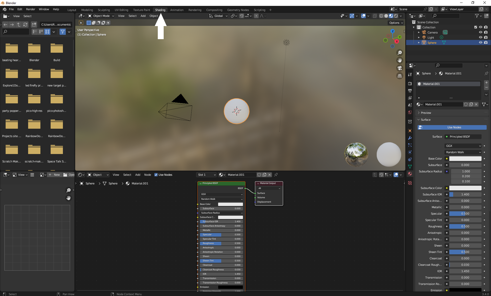

--- /task ---

--- task ---

To make it easier to focus on your material. Go to the 'Viewport Shading' dropdown. Change the 'World Opacity' to `0`:

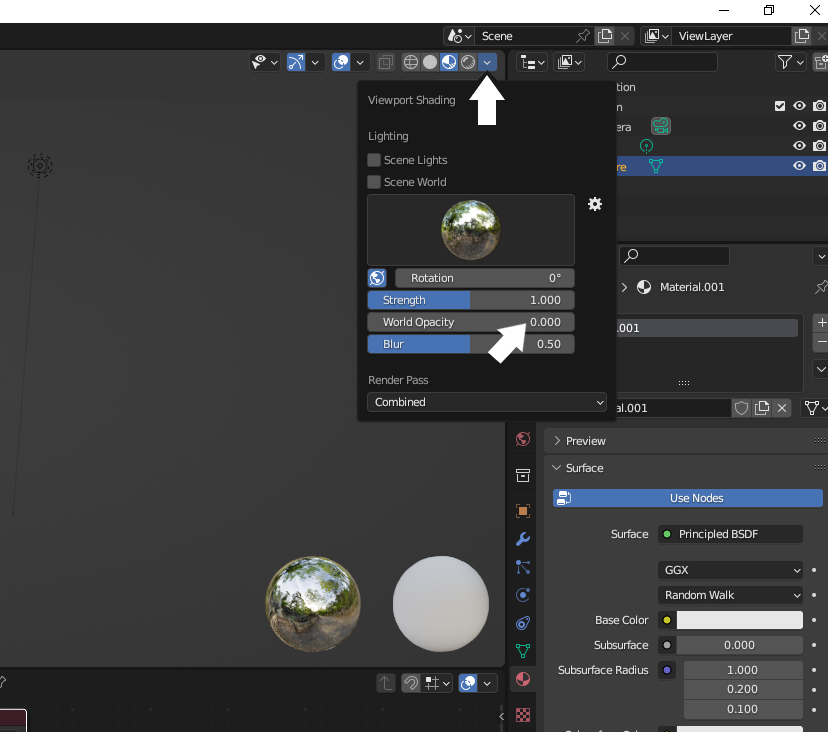

--- /task ---

--- task ---

To see the shading effect, adjust the view of your sphere so that it is 🔎 zoomed in and 🔄 rotated up slightly:

--- collapse ---
---
title: Zoom and rotate in Blender
---

**Tip:** To navigate Blender using a computer mouse with a middle scroll button:
+ Hold the middle-button down and drag the mouse around to rotate the view
+ Scroll the middle-button forward and backward to zoom in and out of the view

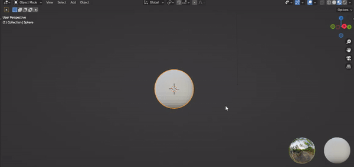

**Tip:** If you do not have a computer mouse with a middle-button you can use the navigation icons. Place the mouse over the **zoom** or **move** icons to see the cursor change to 4 arrows. Hold the left mouse button down then drag the mouse around to change the view. 

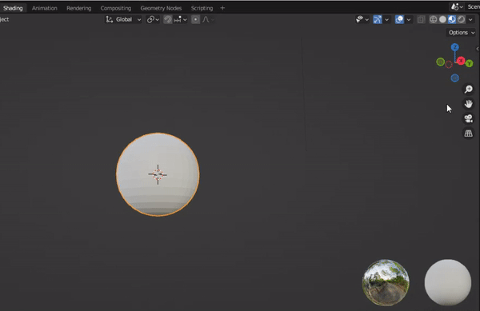

--- /collapse ---

--- /task ---

--- task ---

Go to 'File' -> 'Save As' and save your file as 'marble.blend':

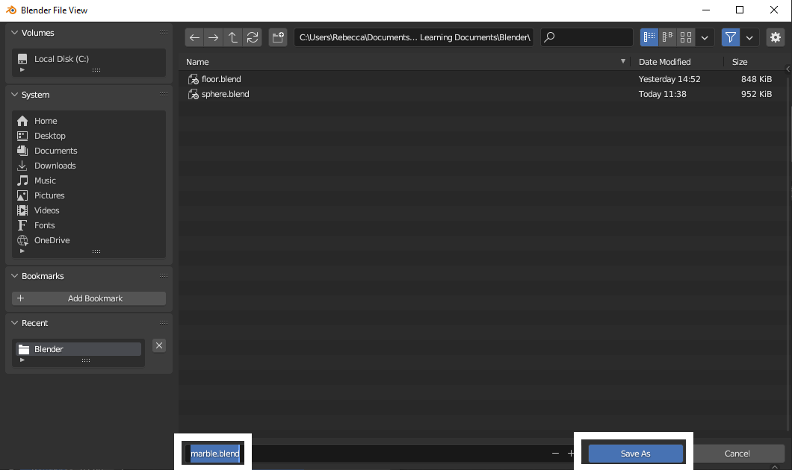

**Tip:** You can reopen a saved Blender project using ‘File’ -> ‘Open’.

--- /task ---

