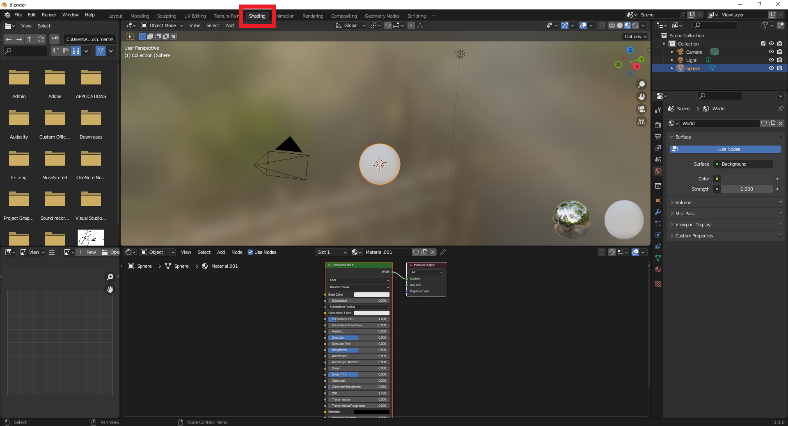

## Create the marble object

Create the marble object using a **UV sphere** and set the opacity to 0.

Image, gif or video showing what they will achieve by the end of the step. {:width="300px"}

--- task ---

Open Blender. Click outside the **splash screen** to close it. 

A **Cube** object has been created for you. The cube has an orange border to show it is the selected object.

--- /task ---

--- task ---

For this project, you need to enable the **Node Wrangler**. 

Go to the menu and choose 'Edit', then click on 'Preferences'.

Now select 'Add-ons' and search for 'node'.

Tick the box next to 'Node: Node Wrangler' then close the Preferences window.

--- /task ---

--- task ---

Click on the **cube** and press **delete** on your keyboard. This will give you an empty document to add in your sphere.

**Tip**: You can also right-click on the cube and choose 'Delete' to delete the cube.

--- /task ---

--- task ---

Add a new **UV Sphere** by going to 'Add' > 'Mesh' > 'UV Sphere'.

--- /task ---

--- task ---

With the Sphere selected, go to the 'Material Properties' tab and click 'New' to add a new material to your sphere.

**Tip**: You know that an object is selected when it has an orange outline.

--- /task ---

--- task ---

Go to the menu at the top of the screen and choose 'Shading'. This will change the view of your project.

--- /task ---

--- task ---

Go to the 'Viewport Shading' dropdown and change the 'World' opacity to 0. 

--- /task ---

