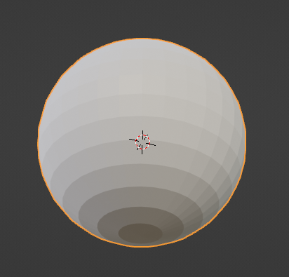
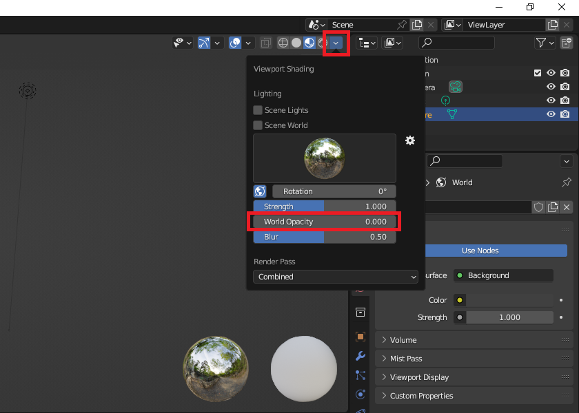
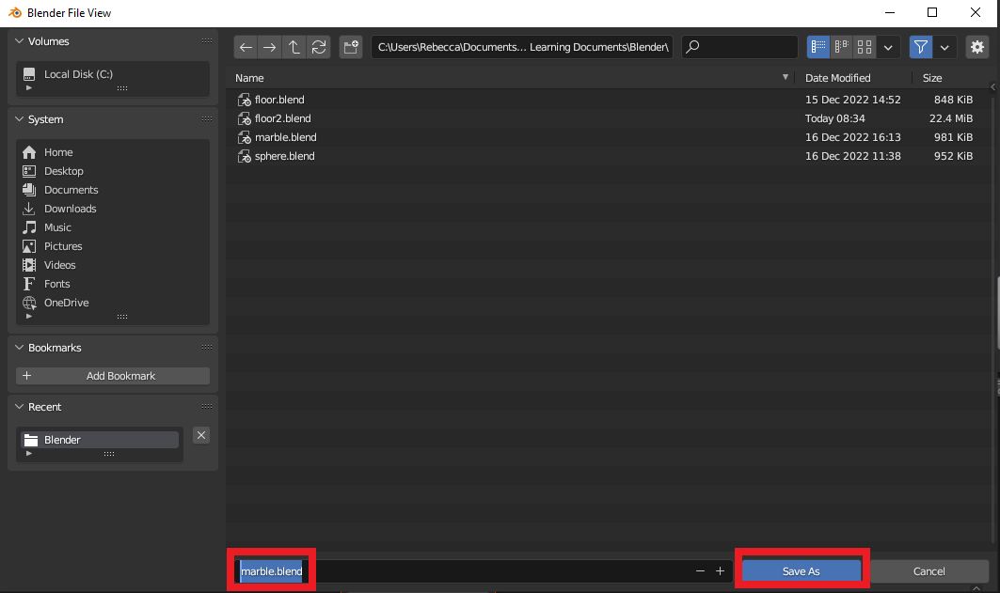

## Create a marble 

Create a marble using a **UV sphere** object. Add a new material to the sphere.

{:width="300px"}

### Set up your project

--- task ---

Open Blender. Click outside the **splash screen** to close it: 

A **Cube** object has been created for you. The cube has an orange outline to show it is the selected object:

--- /task ---

--- task ---

Click on the cube and press <kbd>Delete</kbd> on your keyboard. This will give you an empty document in which you can add your sphere:

**Tip:** To delete the cube, you can also right-click on the cube and choose **Delete**.

--- /task ---

--- task ---

For this project, you need to enable the **Node Wrangler**. 

Go to the **Edit** menu, then choose **Preferences**.

Now select **Add-ons** and search for `node`.

Tick the box next to **Node: Node Wrangler**, then close the Preferences window:

--- /task ---

### Create a marble

--- task ---

Add a new **UV Sphere**. Go to **Add** > **Mesh** > **UV Sphere**:

**Tip:** The icons in Blender are very small. Hold your mouse cursor over them to see a tool tip with the name of the tool.

--- /task ---

--- task ---

With the **Sphere** selected, go to the **Material Properties** tab. Click on **New** to add a new material to your sphere:

**Tip:** An object that is selected has an orange outline.

--- /task ---

### Open the Shading workspace

--- task ---

The **Shading workspace** in Blender is used to design and view materials.

Go to the menu at the top of the screen and choose **Shading**. This will open the Shading workspace:

--- /task ---

--- task ---

To make it easier to focus on your material, go to the **Viewport Shading** drop-down menu and change the **World Opacity** to `0`:

--- /task ---

--- task ---

To see the shading effect, adjust the view of your sphere so that it is 🔎 zoomed in and 🔄 rotated up slightly:

--- collapse ---
---
title: Zoom and rotate in Blender
---

**Tip:** To navigate Blender using a computer mouse with a scroll wheel:
+ Press and hold the scroll wheel down and drag the mouse around to rotate the view
+ Use the scroll wheel to scroll forward and backward to zoom in and out of the view

**Tip:** If you do not have a computer mouse with a scroll wheel, you can use the navigation icons. Place the mouse over the **Zoom** or **Move** icon and the cursor will change to four arrows. Click and hold with the left mouse button and drag the mouse around to change the view. To rotate the view, click and hold on the **Orbit** icon and drag the mouse around.

--- /collapse ---

--- /task ---

--- task ---

**Save** your project. Click on **File** > **Save As...** and save your file as `marble.blend`:

**Tip:** To reopen a saved Blender project, you can click on **File** > **Open**.

--- /task ---

