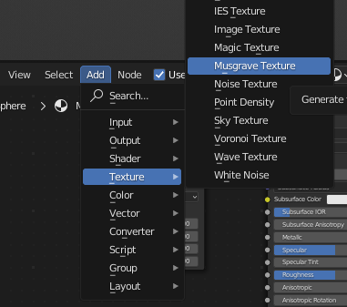
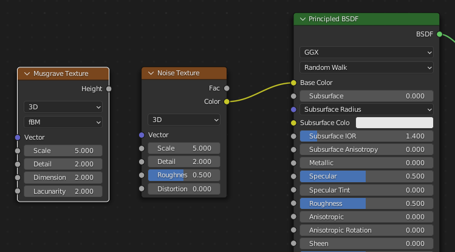
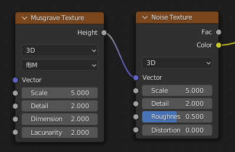
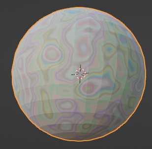

## Add procedural textures

Use **procedural textures** to design your marble material.

{:width="300px"}

--- task ---

Pull up the material window to give you a better view of the material settings:

**Tip**: Move your mouse the the edge of the window. The mouse pointer will change to a double arrow. Click and drag the window up. 

--- /task ---

A **procedural texture** is a texture that has been generated using a set of mathematical rules. Procedural textures are used to make high quality, easily editable, scalable textures that can be added to any surface and still fit together perfectly at the edges. 

### Create a Noise texture

--- task ---

Go to 'Add' -> 'Texture' and select 'Noise Texture':

--- /task ---

--- task ---

Place your new **Noise texture** window to the left of the 'Principled BSDF' box:

**Tip**: The new Noise texture window clings to your mouse until you have clicked it into place.

--- /task ---

--- task ---

Join the **Noise texture** 'Color' to the **Principled BSDF** 'Base color':

**Tip**: Click and drag from the dot next to 'Color' to the dot next to 'Base color'.

--- /task ---

--- task ---

Notice 👀 that the material on the sphere has now changed:

--- /task ---

### Combine textures

--- task ---

A material can use more than one texture. 

Go to 'Add' -> 'Texture' and this time select 'Musgrave Texture':

--- /task ---

--- task ---

Place your new **Musgrave texture** window to the left of the **Noise texture** box:

--- /task ---

--- task ---

Join the **Musgrave texture** 'Height' to the **Noise Texture** 'Vector':

**Tip**: Click and drag from the dot next to 'Height' to the dot next to 'Vector'.

--- /task ---

--- task ---

Notice 👀 that the material on the sphere has again changed:

--- /task ---

### Customise your material

--- task ---

Adjust the 'Vector' settings in the **Musgrave Texture** and **Noise texture** until you are happy with the look of your marble:

**Tip**: To change the setting values, hold the left-mouse button down and drag your mouse to the left or right:

--- /task ---

--- save ---

