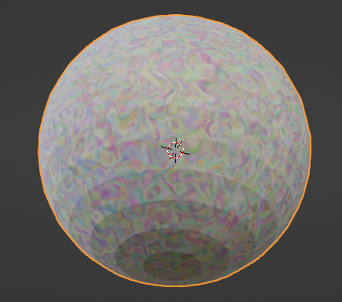
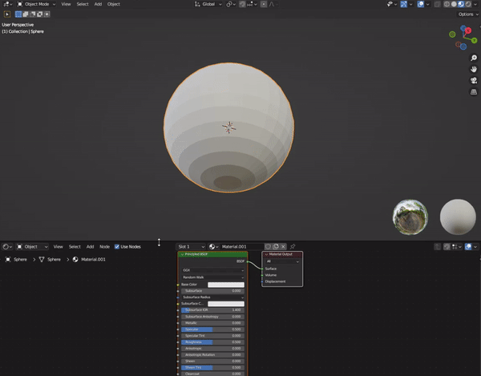
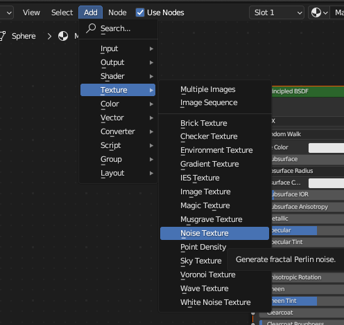
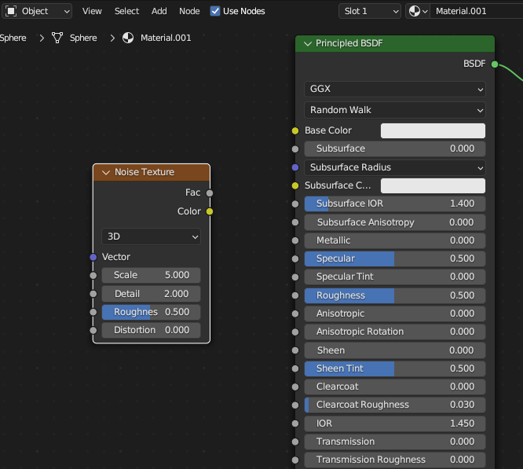
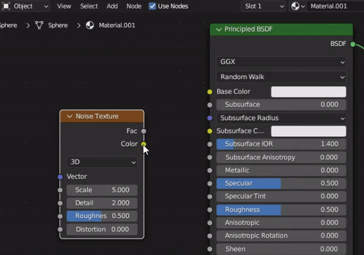
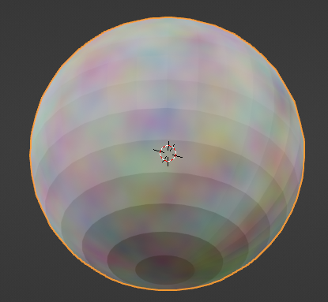
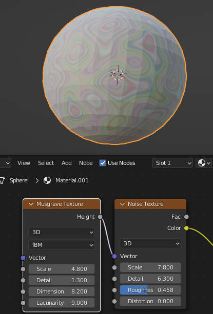
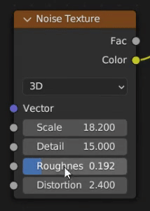

## Add a texture

Add a texture to your marble.

{:width="300px"}

--- task ---

Pull up the material window to give you a better view of the material settings. 

**Tip**: Move your mouse the the edge of the window until the mouse pointer changes to a double arrow. Click and drag the window up. 

--- /task ---

--- task ---

Go to 'Add' > 'Texture' and **choose** a texture that you would like to use. This project uses the 'Noise Texture'.

--- /task ---

--- task ---

Place your new texture window to the left of the 'Principled BSDF' box. 

**Tip**: The new texture window clings to your mouse until you have clicked it into place.

--- /task ---

--- task ---

Join the texture **Color** to the **Base color** of the Principled BSDF.

**Tip**: Click and drag from the dot next to 'Color' to the dot next to 'Base color'.

--- /task ---

--- task ---

Notice 👀 that the texture on the sphere has now changed. 

**Tip**: If you chose a different texture then your sphere might look different to this image.

--- /task ---

--- task ---

Adjust the Vector settings until you are happy with the look of your texture. 

**Tip**: You can drag your mouse from left to right on each value to slide the values and select smaller or larger numbers.

--- /task ---

--- save ---

