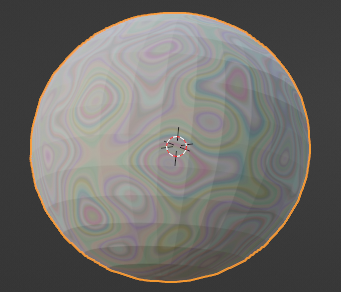

## Add a texture

Add a texture to your marble.

{:width="300px"}

--- task ---

Pull up the material window to give you a better view of the material settings. 

**Tip**: Move your mouse the the edge of the window until the mouse pointer changes to a double arrow. Click and drag the window up. 

--- /task ---

--- task ---

Go to 'Add' > 'Texture' and **choose** a texture that you would like to use. This project uses the 'Noise Texture'.

--- /task ---
