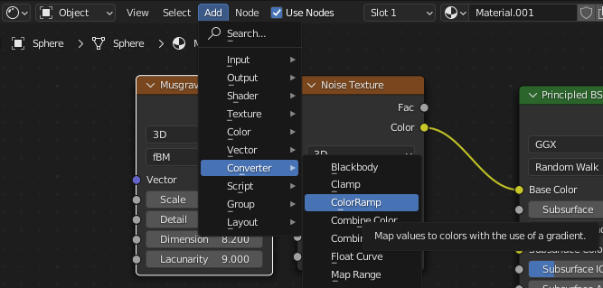

## Choose your colours

Add a **ColorRamp** and adjust the colours to personalise your marble.

{:width="300px"}

### Add a ColorRamp

--- task ---

Go to 'Add' -> 'Converter' -> 'ColorRamp':

--- /task ---

--- task ---

Place the 'ColorRamp' box to the right of your Noise texture box. 

It will snap into place and new joins will be made between the Noise Texture, ColorRamp and Principled BSDF boxes:

**Tip:** If you accidentally place your ColorRamp in a place where it doesn't automatically snap into place you can click and hold the left mouse button to pick it up again then drag it into position. 

--- /task ---

### Change the colours

--- task ---

**Choose** a new colour to replace the white colour.

Click on the white area to the right of the colour bar:

Click on the block of colour at the bottom of the box:

Click on the colour wheel to choose a different colour:

--- /task ---

--- task ---

**Choose** a new colour to replace the black colour.

**Tip**: The colour black has RGB values of 0, 0, 0 so the colour wheel will be black. To see additional colours, drag the RGB values to the right:

--- /task ---

### Customise your colours

--- task ---

**Add** an additional colour by clicking the '+' button above the colour bar:

**Tip**: Adjust the amount of colour used by dragging the paint pots left and right until you are happy:

--- /task ---

--- task ---

**Design**: Continue to add more colours until you are happy with the colour effects on your marble:

**Tip**: If you wish to remove a paint pot then click the '-' button. This will remove the selected pot. 

--- /task ---

--- save ---