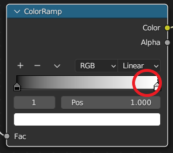

## Choose your colours

Add a **ColorRamp**. Adjust the colours to personalise your marble.

{:width="300px"}

### Add a ColorRamp

--- task ---

Go to **Add** > **Converter** > **ColorRamp**:

--- /task ---

--- task ---

Place the **ColorRamp** box to the right of your **Noise Texture** box.

It will snap into place, and new joins will be made between the Noise Texture, ColorRamp, and Principled BSDF boxes:

**Tip:** If you accidentally place your ColorRamp box where it does not automatically snap into place, you can pick it up again. Click and hold with the left mouse button and drag it into position.

--- /task ---

### Change the colours

--- task ---

**Choose** a new colour to replace the white colour.

Click on the white area to the right of the colour bar:

Click on the block of colour at the bottom of the box:

Click on the colour wheel to choose a different colour:

--- /task ---

--- task ---

**Choose** a new colour to replace the black colour.

**Tip:** The colour black has RGB values of 0, 0, 0, so the colour wheel will be black. To see additional colours, click on the RGB values and drag your mouse to the right to increase the values:

--- /task ---

### Customise your colours

--- task ---

**Add** an additional colour. Click the **+** button above the colour bar:

**Tip:** Drag the colour markers left and right to adjust the colour. Move each marker until you are happy with the effect:

--- /task ---

--- task ---

**Design:** Continue to add more colours until you are happy with your marble:

**Tip:** If you want to remove a colour marker, select the marker then click the **-** button.

--- /task ---

--- save ---