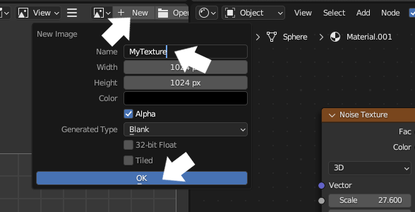
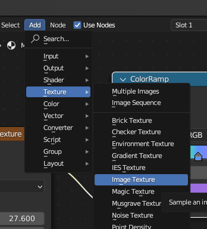
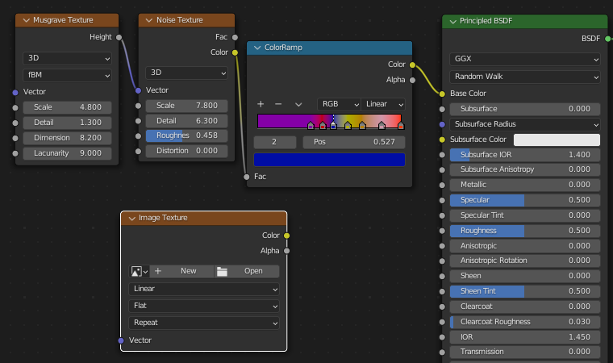
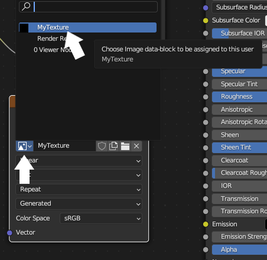
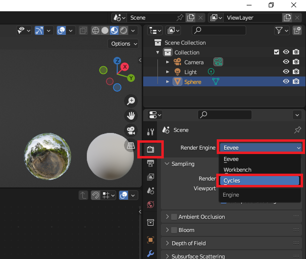
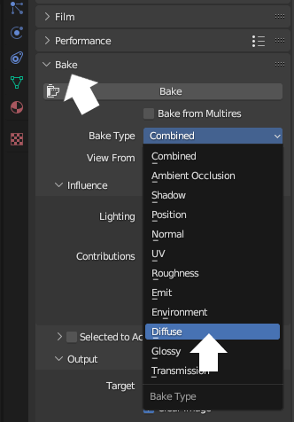
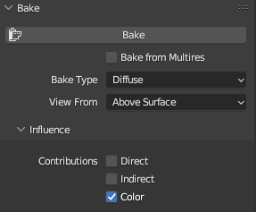
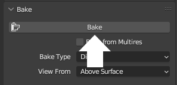

## Create an image of your texture

Create an image of your **texture** so that you can use it with other objects and projects.

{:width="300px"}

Your textured marble is now complete. This step will show you how to save the texture that you have made so that you can use it on other objects and projects.

--- task ---

Go to the 'Image Viewer' menu on the left hand side. Click on '+ New' and give your image a sensible name like `MyTexture`.

Click OK and the area will become black. 

--- /task ---

--- task ---

**Add** a new **Image Texture** by going to 'Add' > 'Texture' > 'Image Texture'.

--- /task ---

--- task ---

Place the 'Image Texture' box away from your other boxes.

--- /task ---

--- task ---

Click on the 'Browse Image' icon and add the image that you just created. You may have named this `MyTexture`.

--- /task ---

--- task ---

Go to the 'Render Properties' tab on the right-hand side. 

Change the 'Render Engine' to 'Cycles'.

--- /task ---

--- task ---

Expand the 'Bake' menu in the 'Render Properties' tab and change the 'Bake Type' to 'Diffuse'.

--- /task ---

--- task ---

Untick 'Direct' and 'Indirect' with the 'Bake' area of the 'Render Properties' tab.

--- /task ---

--- task ---

Make sure that the sphere is selected (it will have an orange outline). 

Click on 'Bake'.

**Note**: This will take a few minutes. 

--- /task ---

--- task ---

You can now save this texture as an image by going to the drop-down with the three lines, choosing 'Image' and then choosing 'Save As'.

--- /task ---

--- save ---