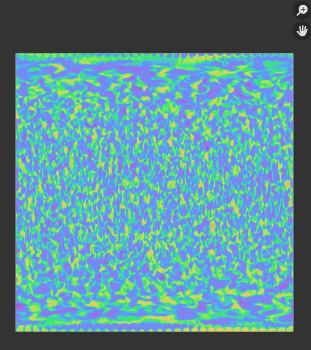

## Create an image of your texture

Create an image of your **texture** so that you can use it with other objects and projects.

{:width="300px"}

Your textured marble is now complete. This step will show you how to save the texture that you have made so that you can use it on other objects and projects.

--- task ---

--- /task ---

--- save ---