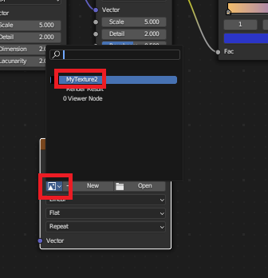

## Create an image of your texture

Create a reusable image of your **texture**.

{:width="300px"}

### Create a blank image

--- task ---

Go to the **Image Editor** in the bottom left-hand corner of the Shading workspace. Open the drop-down menu (with the icon with three lines) and click on **Image**, then **New**:

Give your image a sensible name like `MyTexture` and click on **OK** to create the black/empty image: 

--- /task ---

--- task ---

**Add** a new **Image Texture**. Go to **Add** > **Texture** > **Image Texture**:

--- /task ---

--- task ---

Place the **Image Texture** box away from your other boxes:

--- /task ---

--- task ---

Go to your new **Image Texture** box. Click on the **Browse Image** icon.

Select the image that you just created. You may have named this `MyTexture`:

--- /task ---

### Use Bake to map your material onto the image

**Texture baking** is the process of taking complex surface data from a 3D object and saving it to a 2D image. The image can then be used on another 3D object or even exported to be used in another piece of software.

--- task ---

Go to the **Render Properties** tab on the right-hand side of the workspace.

To use **Bake**, change the **Render Engine** to **Cycles**:

--- /task ---

--- task ---

The most common type of texture baking is **Diffuse baking**.

In the **Render Properties** tab, expand the **Bake** panel and change the **Bake Type** to **Diffuse**:

--- /task ---

--- task ---

In the **Bake** panel, untick **Direct** and **Indirect** lighting influences:

--- /task ---

--- task ---

Make sure that the sphere is selected (it will have an orange outline). 

Click on **Bake**:

**Note:** It will take a few minutes for your image to be created: 

--- /task ---

### Save your image

--- task ---

You can now save this texture as an image. Go to the drop-down menu in the Image Editor (the icon with three lines) and choose **Image**, then **Save As...**:

--- /task ---

--- save ---