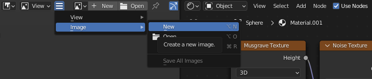
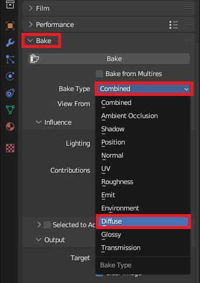
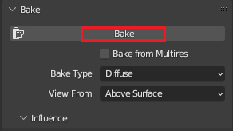

## Create an image of your texture

Create an image of your **texture** so that you can use it with other objects and projects.

{:width="300px"}

### Create a blank image

--- task ---

Go to the 'Image Viewer' menu in the bottom-left of the Shading editor. Click on '+ New' and give your image a sensible name like `MyTexture`.

Click OK and the area will become black. 

--- /task ---

--- task ---

**Add** a new **Image Texture** by going to 'Add' > 'Texture' > 'Image Texture'.

--- /task ---

--- task ---

Place the 'Image Texture' box away from your other boxes.

--- /task ---

--- task ---

Go to your new Image Texture box and click on the 'Browse Image' icon. 

Select the image that you just created. You may have named this `MyTexture`.

--- /task ---

### Bake your material onto the image

**Texture baking** is the process of taking complex surface data from a 3D object and saving it to a 2D texture image. The image can then be used on another 3D object or even exported to be used in another software.

--- task ---

Go to the 'Render Properties' tab on the right-hand side. 

To allow baking, change the 'Render Engine' to 'Cycles'.

--- /task ---

--- task ---

The most common type of baking used to create textures is **Diffuse baking**. 

Expand the 'Bake' menu in the 'Render Properties' tab and change the 'Bake Type' to 'Diffuse'.

--- /task ---

--- task ---

In the 'Bake' menu, untick 'Direct' and 'Indirect' lighting influences.

--- /task ---

--- task ---

Make sure that the sphere is selected (it will have an orange outline). 

Click on 'Bake'.

**Note**: This will take a few minutes. 

--- /task ---

--- task ---

You can now save this texture as an image, go to the drop-down with the three lines, choose 'Image' and then 'Save As'.

--- /task ---

--- save ---