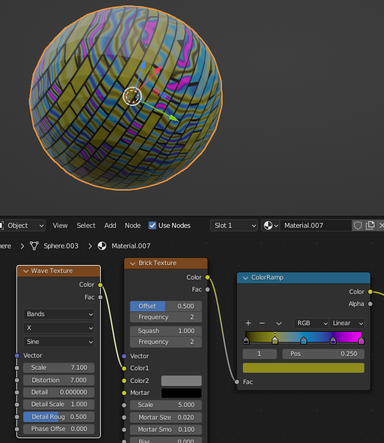
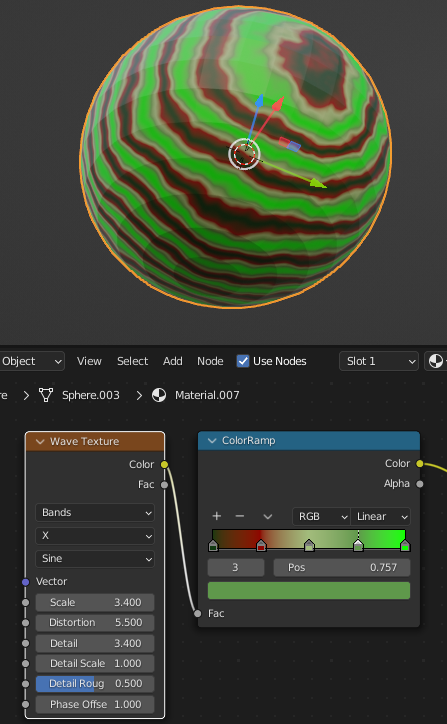
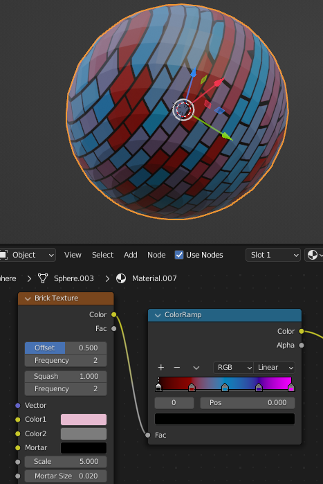

## Upgrade your project

Experiment with other textures, colours, and shapes.

{:width="300px"}

--- task ---

Add different textures. Experiment with texture order and joins to see what patterns you can create.

You could try the **Wave Texture**:

Or the **Brick Texture**:

Or both together!

--- /task ---

--- task ---

Remember to use **Bake** then save your images so that you can use them again later.

--- /task ---

--- save ---