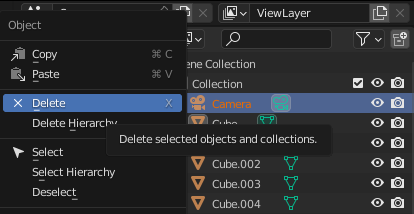
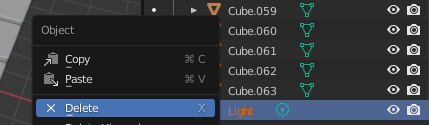
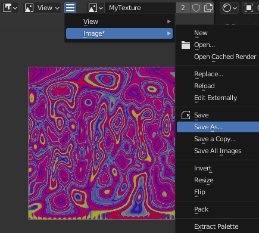
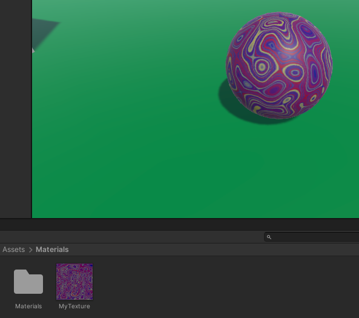

## Use your material in Unity

The marble texture from this **Blender - Add material effects to a marble** project  can be exported and used in our [More Unity](https://projects.raspberrypi.org/en/pathways/more-unity) path. 

<mark>Embed webGL of Explore project with marble</mark>

### Use Blender to export your material

--- task ---

Unity projects already have a camera. Go to the **Scene Collection** pane and right-click on the 🎥 Camera then select 'Delete': 

--- /task ---

--- task ---

Unity projects already have a light source. Go to the **Scene Collection** pane and right-click on the 💡 Light then select 'Delete':

--- /task ---

--- task ---

If you haven't already saved your texture as an image, go to the drop-down with the three lines, choose 'Image' and then 'Save As':

--- /task ---

### Import your material into Unity

--- task ---

Open your Unity project and from the **Assets** menu select **Import New Asset...**. Find your texture and Import it. 

Your texture will appear in the **Project window**. You can drag it onto a 3D object in the Scene view or the Inspector use it in your Unity project:

--- /task ---