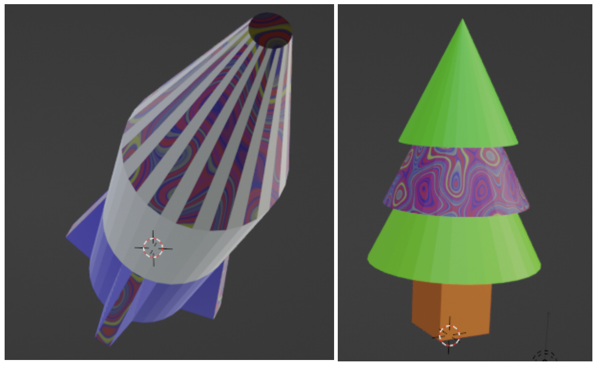

## Use your material in Unity

### Blender animation path

Our [Blender basics](https://projects.raspberrypi.org/en/pathways/blender-basics) path covers how to create, animate and render 3D objects and scenes to make a Snow scene animation:

<video width="560" height="315" controls>
<source src="resources/snow-scene-rendered.mkv" type="video/mp4">
Your browser does not support WebM video, try FireFox or Chrome
</video>

**Tip:** In this path you will create a snowman, trees, a car, a house, and a rocket. Think about how you could use your new material:

### Blender - Create a 3D tiled floor

The marble texture from this **Blender - Add material effects to a marble** project and the tile floor from the [Blender - Create a 3D tiled floor](https://projects.raspberrypi.org/en/projects/blender-marble) project can be exported and used in our [More Unity](https://projects.raspberrypi.org/en/pathways/more-unity) path. 

**Tip:** If you have not used Unity before you can start with our [Introduction to Unity](https://projects.raspberrypi.org/en/pathways/unity-intro) path to make 3D worlds with quests and games.